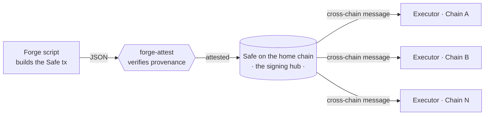

<picture>
  <source media="(prefers-color-scheme: dark)" srcset="https://raw.githubusercontent.com/crossecute/.github/main/brand/crossecute-icon-black.png" />
  
</picture>

**One multisig, on the chain you trust. Control on every other.**

---

## The idea

Multichain protocols end up with a governance mess: a separate multisig on every
chain, each with its own signers, nonces, and signing rituals. Every extra signing
surface is another place to get phished, fat-finger a payload, or lose quorum.

**crossecute collapses that to one signing hub.** A single [Safe](https://safe.global)
is the source of authority; its approved actions are carried to any destination
chain and executed there. You sign once, on the chain you trust most — operations
land everywhere.

Which chain that is, is yours to pick. Ethereum is the expected anchor and the
reason most people will read this as an Ethereum story, but nothing in the
protocol requires it: a team can centralize on whichever chain they are willing
to anchor to, and every destination is told which one at deployment.

The hard part isn't the messaging — it's **trust in what you sign**. If an operator
builds a transaction with a script in one repo and submits it to the Safe in another,
how does a signer know the thing in the queue is exactly what the script produced, and
wasn't altered in between? That gap is where crossecute starts.

## Building blocks

| Repo | What it does | Status |
|------|--------------|--------|
| [**forge-attest**](https://github.com/crossecute/forge-attest) | Proves a submitted Safe transaction is byte-for-byte the output of a specific Forge script, at a pinned commit — reproduced, hashed three independent ways, and checked against the live Safe queue. | ✅ Available |
| [**forge-attest-example-safe-ops**](https://github.com/crossecute/forge-attest-example-safe-ops) | Reference "producer" repo: a deterministic Forge script that builds a Safe tx, verified by forge-attest. | ✅ Available |
| Cross-chain executor | Home-chain Safe → destination-chain execution over a messaging layer. One owner, one address, every chain. | 🚧 In progress |

## Principles

- **Don't trust, verify.** Every artifact is reproducible and independently checkable.
  Provenance is derived, never asserted.
- **One signing surface.** Fewer multisigs, fewer nonces, fewer ways to be tricked.
- **The anchor is a choice, not a constant.** The home chain is a deployment
  parameter. Centralize where your trust already is.
- **Composable, not monolithic.** Each piece (provenance, execution, tooling) stands
  alone and is useful on its own.

## Status

Early. The verification layer is public and working; the routing layer is in
development. Issues and questions are welcome on any repo above.
